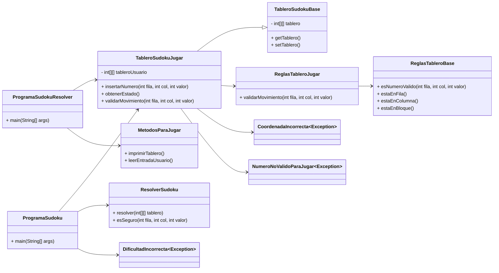
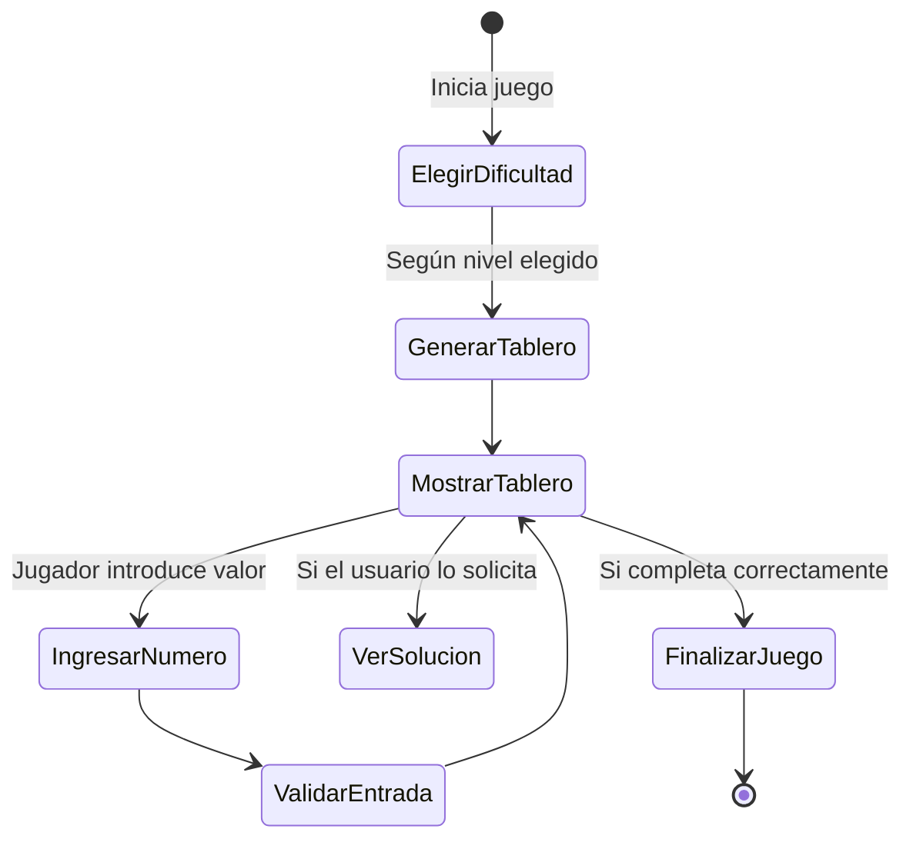

# 🗺️ Representación Visual del Proyecto Sudoku (Java)

## 🧩 Mapa de Clases

---

## 🎮 Interacciones del Usuario (Casos de Uso)

---

## 🔗 Matriz de trazabilidad

| Funcionalidad Clave                         | Módulo Asociado             | Métodos Relevantes                        | Casos de Prueba o Uso                 |
|--------------------------------------------|-----------------------------|-------------------------------------------|----------------------------------------|
| Crear tablero inicial                       | `TableroSudokuBase`         | `setTablero()`, `getTablero()`            | `testCrearTablero()`                   |
| Insertar valores y comprobar jugadas        | `TableroSudokuJugar`        | `insertarNumero()`, `validarMovimiento()` | `testInsertarYValidar()`              |
| Validaciones de Sudoku                      | `ReglasTableroJugar`        | `validarMovimiento()`                     | `testReglasSudoku()`                   |
| Comprobar posiciones válidas                | `ReglasTableroBase`         | `esNumeroValido()`                        | `testVerificarCasilla()`              |
| Resolver tablero automáticamente            | `ResolverSudoku`            | `resolver()`, `esSeguro()`                | `testResolucionBacktracking()`        |
| Manejo de errores de entrada                | `*Incorrecta.java`          | `throw new ...`                           | `testErroresPersonalizados()`         |
| Modo visual con Swing                       | `ProgramaSudoku`            | `main()`                                  | `testGUI()`                            |
| Interfaz por consola                        | `ProgramaSudokuResolver`    | `main()`                                  | `testConsola()`                        |

